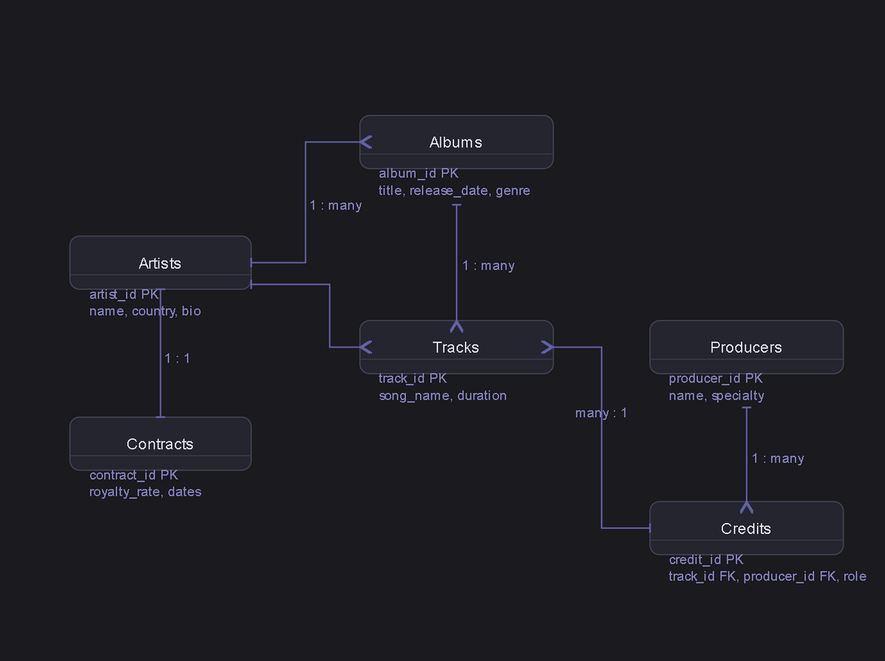

# 🎵 Music Label Management System

A command-line database application for managing a music label's artists, albums, tracks, producers, and contracts. Built with Python and MySQL.

**Developer:** Reece  
**Class:** Database Final Project

---

## 📐 Entity Relationship Diagram



> ERD built using Crow's Foot notation. 6 entities with one-to-one, one-to-many, and many-to-many relationships.

---

## 🗂 Table Descriptions

| Table | Description |
|-------|-------------|
| `artists` | Stores artist name, country of origin, and biography |
| `albums` | Stores album title, release date, and genre — linked to one artist |
| `tracks` | Stores individual songs, duration, and file type — linked to one album |
| `producers` | Stores producer name and their specialty (beat making, mixing, etc.) |
| `contracts` | Stores royalty rate, contract dates, and status — one per artist |
| `credits` | Junction table linking tracks to producers with a role field |

---

## 🔗 Relationships

- **Artists → Albums** — One artist can have many albums (1:M)
- **Albums → Tracks** — One album contains many tracks (1:M)
- **Artists → Contracts** — Each artist has exactly one contract (1:1)
- **Tracks ↔ Producers** — A track can have many producers and a producer can work on many tracks (M:N via `credits`)

---

## ⚙️ Setup Instructions

### Prerequisites
- Python 3.x
- MySQL running on port 3306 (Docker recommended)
- pip

### 1. Clone the repository
```bash
git clone https://github.com/YOUR_USERNAME/music-label-db.git
cd music-label-db
```

### 2. Install Python dependencies
```bash
pip install -r requirements.txt
```

### 3. Start MySQL (Docker)
```bash
docker run -d --name music_label \
  -e MYSQL_ROOT_PASSWORD=password \
  -p 3306:3306 \
  mysql:latest
```

### 4. Load the database
```bash
docker exec -i music_label mysql -u root -ppassword < schema.sql
docker exec -i music_label mysql -u root -ppassword < data.sql
```

### 5. Run the app
```bash
python3 main.py
```

---

## 📁 File Structure

```
music-label-db/
├── main.py          # Application entry point / CLI menus
├── database.py      # All database connection and query functions
├── schema.sql       # CREATE TABLE statements
├── data.sql         # Sample data (20+ rows per table)
├── queries.sql      # 8 example queries
├── requirements.txt # Python dependencies
└── README.md        # This file
```

---

## ✨ Features

- **View all artists** and search by name
- **Browse albums** by artist and tracks by album
- **Search songs** by name across the entire catalog
- **View producer credits** for any track
- **Manage contracts** — view and update contract status
- **Sign new artists** via an atomic transaction (artist + contract created together, rolls back if either fails)
- **Reports menu:**
  - Active contracts with royalty rates
  - Tracks filtered by genre
  - Producer credit leaderboard
- Full **CRUD operations** across artists, albums, tracks, and contracts
- **Parameterized queries** throughout to prevent SQL injection
- **Error handling** with try/except on all database operations
- **Delete with confirmation** — requires typing YES to confirm

---

## 📸 Example Usage

```
╔══════════════════════════════════════════════════════╗
║        🎵  Music Label Management System             ║
╚══════════════════════════════════════════════════════╝
  ✅ Connected to music_label database.

═══════════════════════════════════════════════════════
  MAIN MENU
═══════════════════════════════════════════════════════
  1. Artists
  2. Albums & Tracks
  3. Contracts
  4. Producers
  5. Sign New Artist  (transaction)
  6. Reports
  0. Exit
```

---

## ⚠️ Known Limitations

- Password is hardcoded in `database.py` — would use environment variables in production
- No support for multiple artists on a single album (one main artist per album)
- File type is limited to mp3, wav, flac, aac

---

## 💭 Reflection

Building this project taught me a lot about how relational databases actually work in practice. Designing the ERD first made everything else easier — once the relationships were clear on paper, writing the SQL schema felt straightforward. The trickiest part was the many-to-many between tracks and producers, but using the `credits` junction table with a `role` column made it clean and flexible.

Connecting Python to MySQL was more challenging than expected. Getting the Docker container set up, dealing with authentication plugins, and debugging connection errors took a lot of troubleshooting. But once it clicked, it was satisfying to see the app actually pulling real data from the database through the terminal.

If I had more time, I would add a web front end using Flask so it's easier to use than a command-line menu. I'd also store the database password in a `.env` file instead of hardcoding it, and add support for albums with multiple featured artists.
